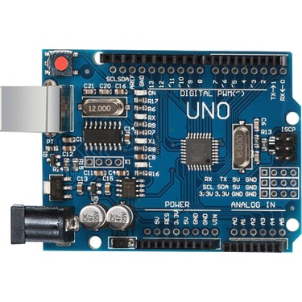

#Ders-1

Merhabalar,

Arduino Derslerinin 1. Bölümüne hoşgeldiniz.

Bu bölümde yapacaklarımız:
  1)Arduino Nedir? Ne işe yarar? Nerede kullanabilir?__
  2)Komponentler nedir? Arduino ile Nasıl kullanılır ?
  3)Giriş seçenekleri / bağlantıları / pinleri
  4)Kart programlama araçları
  5)Kod döngüleri
  6)Sorgular(if)
  7)Nasıl Kodlanır?
 
### 1)Arduino Nedir? Ne işe yarar? Nerede kullanabilir?
  Arduino okullar için oluşturulan dünyadaki en ünlü Maker 

Arduino klon:

asd
